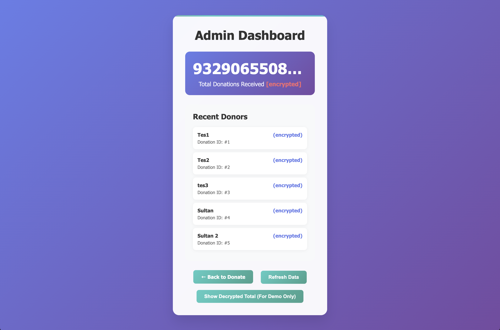

# 🛡️ Donation Privacy System using Paillier Homomorphic Encryption

This is a privacy-preserving donation system that securely collects and aggregates encrypted donation values using Paillier Homomorphic Encryption algorithm. It ensures that individual donation amounts remain confidential. (**For demonstration purpose**, the administrator is allowed to see the decrypted total donation sum)

Built with:
- Python (Flask)
- SQLite
- `phe` library (Paillier encryption)
- HTML/CSS/JS for the interface

---

## 📌 Features

- **Homomorphic Encryption**: Donations are encrypted on the client side before storage.
- **Aggregate Computation**: Server decrypts only the **total donation** (for demonstration purpose), not individual values.
- **Admin Dashboard**: Displays total donations and encrypted entries per donor.
- **Multiple Donors**: Users can submit multiple donations under different names.
- **SQLite Database**: Lightweight, serverless data storage.

---

## 🖥️ Screenshots




---

## 🚀 How to Run

### 1. Install Dependencies

Make sure you have **Python 3.9+** and `pip` installed.

```bash
pip install flask phe
```

### 2. Run The Program
```bash
python app.py
```
DB and pickle files will auto-generated when running the program
---

## 👱🏻‍♂️ Made by

Christoper Daniel

18222034

Bandung Institute of Technology
